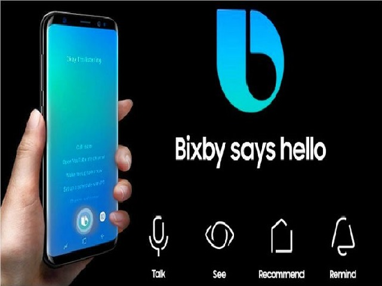
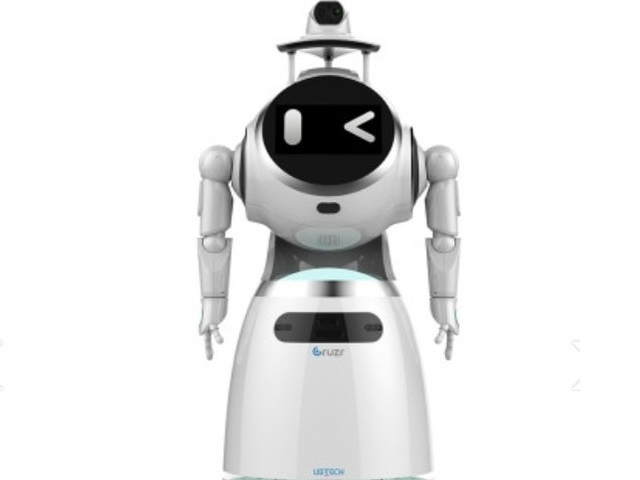
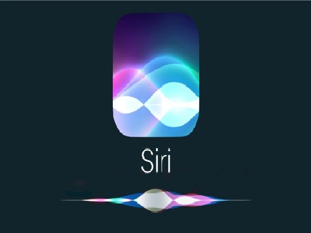
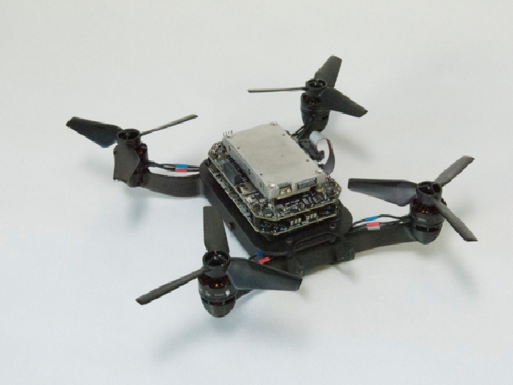

<!DOCTYPE html>
<html lang="en">
  <head>
    <meta charset="utf-8">
    <meta http-equiv="X-UA-Compatible" content="IE=edge">
    <meta name="viewport" content="width=device-width, initial-scale=1">
    <!-- The above 3 meta tags *must* come first in the head; any other head content must come *after* these tags -->
    <title>AI : Home</title>
    <!-- Favicon -->
    <link rel="shortcut icon" type="image/icon" href="assets/images/favicon.ico"/>
    <!-- Font Awesome -->
    <link href="https://maxcdn.bootstrapcdn.com/font-awesome/4.6.3/css/font-awesome.min.css" rel="stylesheet">
    <!-- Bootstrap -->
    <link href="assets/css/bootstrap.min.css" rel="stylesheet">
    <!-- Slick slider -->
    <link href="assets/css/slick.css" rel="stylesheet">
    <!-- Gallery Lightbox -->
    <link href="assets/css/magnific-popup.css" rel="stylesheet">
    <!-- Theme color -->
    <link id="switcher" href="assets/css/theme-color/default-theme.css" rel="stylesheet">

    <!-- Main Style -->
    <link href="style.css" rel="stylesheet">

    <!-- Fonts -->

    <!-- Open Sans for body font -->
	<link href="https://fonts.googleapis.com/css?family=Open+Sans:300,400,400i,600,700,800" rel="stylesheet">
    <!-- Poppins for Title -->
  	<link href="https://fonts.googleapis.com/css?family=Poppins" rel="stylesheet">
 
 
	
    <!-- HTML5 shim and Respond.js for IE8 support of HTML5 elements and media queries -->
    <!-- WARNING: Respond.js doesn't work if you view the page via file:// -->
    <!--[if lt IE 9]>
      
      
    <![endif]-->
  </head>
  <body>
  	
  	<!-- Start Header -->
	<header id="mu-header" class="" role="banner">
		

			<nav class="navbar navbar-default mu-navbar">
		  

		    <!-- Brand and toggle get grouped for better mobile display -->
		    

		      <button type="button" class="navbar-toggle collapsed" data-toggle="collapse" data-target="#bs-example-navbar-collapse-1" aria-expanded="false">
		        Toggle navigation
		        
		        
		        
		      </button>

		      <!-- Text Logo -->
		      <a class="navbar-brand" href="#">AIHome</a>

		      <!-- Image Logo -->
		      <!--  -->

		    

		    <!-- Collect the nav links, forms, and other content for toggling -->
		    

		      	<ul class="nav navbar-nav mu-menu navbar-right">
			        <li><a href="#">HOME</a></li>
			        <li><a href="#mu-about">ABOUT US</a></li>
			        <li><a href="#mu-service">TYPE</a></li>
		            <li><a href="#mu-portfolio">IMAGE</a></li>
		            <li><a href="#mu-testimonials">CONTANT</a></li>
		            <li><a href="#mu-contact">CONTACT</a></li>
		      	</ul>
		    
<!-- /.navbar-collapse -->
		  
<!-- /.container-fluid -->
		</nav>
		

	</header>
	<!-- End Header -->

	<!-- Start Featured Slider -->

	<section id="mu-featured-slider">
		

			

				

					

						<h1>AI Home</h1>

						<!-- Start text slide -->
						

							

								
I am Lee jae Hwan

								
I am Studen

		   						
I am study css/html

							

							
						

						<!-- Start text slide -->
						
						

							
AI HOME에 오신것을 환영합니다. 이곳에서는 AI에 대한 정보를 제공합니다.

							<a href="#mu-portfolio" class="mu-primary-btn view-my-work-btn">VIEW MY WORK</a>
						

					

				
			
			

		

	</section>
	
	<!-- Start Featured Slider -->
	
	<!-- Start main content -->
		
	<main role="main">

		<!-- Start About -->
		<section id="mu-about">
			

				

					

						

							

								<h2 class="mu-heading-title">ABOUT ME</h2>
								
								
저의 이름은 이재환 입니다<strong> CSS</strong> 와 <strong>HTML</strong>을 공부하고 있습니다. 메카트로닉스 공학을 다니고 있으며 여기서 여러 과목을 배우고 있습니다.

							

							<!-- Start About Us Content -->
							

								

									

										

											
										

									

									

										

			
											<!-- Start skills progress bar -->

						                  	

						                  		<h3>공부중인 과목</h3>
							                    기계설계
							                    

							                      
							                    

							                    네트워크
							                    

							                     
							                    

							                    마이컴
							                    

							                    

							                    PLC
							                    

							                    

							                    캡스톤
							                    

							                    

						                  	

						                  	<!-- Start Social Media -->
						                  	

						                  		<h3>Social</h3>
						                  		<a href="#"><i class="fa fa-facebook"></i></a>
						                  		<a href="#"><i class="fa fa-twitter"></i></a>
						                  		<a href="#"><i class="fa fa-linkedin"></i></a>
						                  		<a href="#"><i class="fa fa-google-plus"></i></a>
						                  	

						                  	<!-- Download Ressume Button -->
						                  	<a href="#" class="mu-resume-btn">Download My Resume</a>

										

									

								

							

							<!-- End About Us Content -->

						

					

				

			

		</section>
		<!-- End About -->

		<!-- Start Service -->
		<section id="mu-service">
			

				

					

						

							

								<h2 class="mu-heading-title">AI의 기술 종류</h2>
								
								
이곳은 간략하게 AI에 사용되는 기술 종류에 대해 설명합니다.

							

							<!-- Start Service Content -->
							

								

									<!-- Service Single Content -->
									

										

											
												<i class="fa fa-leaf"></i>
											
											<h4>퍼지 이론</h4>
											
자연상의 모호한 상태,자연 언어에서의 애매모호함을 정량적으로 표현하거나, 정량적인 값을 자연의 애매모호한 값으로 바꾸기 위해 도입된 개념.

										

									

									<!-- / Service Single Content -->

									<!-- Service Single Content -->
									

										

											
												<i class="fa fa-desktop"></i>
											
											<h4>기계학습</h4>
											
이름 그대로 컴퓨터에 인공적인 학습 가능한 지능을 부여하는 것을 연구하는 분야이다.

										

									

									<!-- / Service Single Content -->

									<!-- Service Single Content -->
									

										

											
												<i class="fa fa-neuter"></i>
											
											<h4>인공신경망</h4>
											
 기계학습 분야에서 연구되고 있는 학습 알고리즘들 중 하나. 주로 패턴인식에 쓰이는 기술로, 인간의 뇌의 뉴런과 시냅스의 연결을 프로그램으로 재현하는 것이다.

										

									

									<!-- / Service Single Content -->

									<!-- Service Single Content -->
									

										

											
												<i class="fa fa-heart"></i>
											
											<h4>유전 알고리즘</h4>
											
자연의 진화 과정, 즉 어떤 세대를 구성하는 개체군의 교배(CrossOver)와 돌연변이(Mutation)과정을 통해 세대를 반복시켜 특정한 문제의 적절한 답을 찾는 것.

										

									

									<!-- / Service Single Content -->

									<!-- Service Single Content -->
									

										

											
												<i class="fa fa-optin-monster"></i>
											
											<h4>인공생명체</h4>
											
 말 그대로 프로그램에 단순한 인공지능이 아닌 실제 살아있는 유기체처럼 스스로 움직이고 생활하기 위한 능력을 부여하는 것.

										

									

									<!-- / Service Single Content -->

									<!-- Service Single Content -->
									

										

											
												<i class="fa fa-gamepad"></i>
											
											<h4>비디오 게임</h4>
											
 비디오 게임에 등장하는 적은 원시적인 인공지능이다. 가만히 있거나 플레이어의 움직임에 따라 반응해서 거기에 맞추 공격이나 방어, 회피 등을 구사하는 판단이 마치 살아 움직이는 생명체의 성격과 비슷하다.

										

									

									<!-- / Service Single Content -->

								

							

							<!-- End Service Content -->

						

					

				

			

		</section>
		<!-- End Service -->

		<!-- Start Portfolio -->
		<section id="mu-portfolio">
			

				

					

						

							

								<h2 class="mu-heading-title">AI의 이용</h2>
								
							

							<!-- Start Portfolio Filter -->
							

								<ul class="mu-simplefilter">
					                <li class="active" data-filter="all">All</li>
					                <li data-filter="1">모바일</li>
					                <li data-filter="2">사물</li>
					                <li data-filter="3">로봇</li>
					                <li data-filter="4">프로그램</li>
					            </ul>
							

							<!-- Start Portfolio Content -->
							

								

					                

					                	

					                		
					                	

					                	

					                    	<h4 class="mu-filter-item-title">빅스비</h4>
					                    	<a class="mu-filter-link" href="#"><i class="fa fa-link"></i></a>
					                    	<a class="mu-filter-imglink" href="assets/images/bixby.jpg" title="빅스비"><i class="fa fa-search"></i></a>
					                    

					                

					                

					                	

					                		
					                	

					                	

					                    	<h4 class="mu-filter-item-title">카카오 스피커</h4>
					                    	<a class="mu-filter-link" href="#"><i class="fa fa-link"></i></a>
					                    	<a class="mu-filter-imglink" href="assets/images/kakao.jpg" title="카카오 스피커"><i class="fa fa-search"></i></a>
					                    

					                

					                

					                	

					                		
					                	

					                	

					                    	<h4 class="mu-filter-item-title">로봇 청소기</h4>
					                    	<a class="mu-filter-link" href="#"><i class="fa fa-link"></i></a>
					                    	<a class="mu-filter-imglink" href="assets/images/robot.jpg" title="로봇 청소기"><i class="fa fa-search"></i></a>
					                    

					                

					                

					                	

					                		
					                	

					                	

					                    	<h4 class="mu-filter-item-title">페퍼</h4>
					                    	<a class="mu-filter-link" href="#"><i class="fa fa-link"></i></a>
					                    	<a class="mu-filter-imglink" href="assets/images/pepper.jpg" title="페퍼"><i class="fa fa-search"></i></a>
					                    

					                

					                

					                	

					                		
					                	

					                	

					                    	<h4 class="mu-filter-item-title">크루저 헬스키퍼</h4>
					                    	<a class="mu-filter-link" href="#"><i class="fa fa-link"></i></a>
					                    	<a class="mu-filter-imglink" href="assets/images/cruzer.jpg" title="크루저 헬스키퍼"><i class="fa fa-search"></i></a>
					                    

					                

					                

					                	

					                		
					                	

					                	

					                    	<h4 class="mu-filter-item-title">시리</h4>
					                    	<a class="mu-filter-link" href="#"><i class="fa fa-link"></i></a>
					                    	<a class="mu-filter-imglink" href="assets/images/siri.jpg" title="시리"><i class="fa fa-search"></i></a>
					                    

					                

					                

					                	

					                		
					                	

					                	

					                    	<h4 class="mu-filter-item-title">자율주행 프로그램</h4>
					                    	<a class="mu-filter-link" href="#"><i class="fa fa-link"></i></a>
					                    	<a class="mu-filter-imglink" href="assets/images/car.jpg" title="자율주행 프로그램"><i class="fa fa-search"></i></a>
					                    

					                

					                

					                	

					                		
					                	

					                	

					                    	<h4 class="mu-filter-item-title">자율비행 드론</h4>
					                    	<a class="mu-filter-link" href="#"><i class="fa fa-link"></i></a>
					                    	<a class="mu-filter-imglink" href="assets/images/dron.png" title="자율비행 드론"><i class="fa fa-search"></i></a>
					                    

					                

					                

					                	

					                		
					                	

					                	

					                    	<h4 class="mu-filter-item-title">강아지 로봇</h4>
					                    	<a class="mu-filter-link" href="#"><i class="fa fa-link"></i></a>
					                    	<a class="mu-filter-imglink" href="assets/images/dog robot.jpg" title="강아지 로봇"><i class="fa fa-search"></i></a>
					                    

					                

					            

							

							<!-- End Portfolio Content -->

						

					

				

			

		</section>
		<!-- End Portfolio -->

		<!-- Start Testimonials -->
		<section id="mu-testimonials">
			

				

					

						

							

								<h2 class="mu-heading-title">AI에 대한 정의</h2>
								
							

							

								<ul class="mu-testimonial-slide">

									<li>
										<i class="fa fa-quote-right mu-quote-icon"></i>
										
인공지능이란 무엇인가, 무엇을 지능이라고 부를까를 명확하게 정의하기는 쉽지 않다. 그리고 이는 철학적인 문제가 아니고 이 문제에 어떤 대답을 선호하는가에 따라서 연구 목적과 방향이 완전히 달라진다.

											한 가지 대답은 인간의 '지능'을 필요로 하는 일을 컴퓨터가 처리할 수 있으면 그것이 바로 인공지능이라는 것이다. 또 다른 대답은 인간과 같은 방식으로 이해를 할 수 있어야 인공지능이라는 것이다.

										<h5 class="mu-ct-name"> NAMUWIKI</h5>
										인공지능
									</li>

								</ul>
							

						

					

				

			

		</section>
		<!-- End Testimonials -->

		<!-- Start Contact -->
		<section id="mu-contact">
			

				

					

						

							

								<h2 class="mu-heading-title">CONTACT ME</h2>
								
								
혹시 더 추가하고 싶은 내용이나, 수정하고 싶은 내용이 있으면 연락 바랍니다.

							

							<!-- Start Contact Content -->
							

								

									

										

											

												

													

														
<i class="fa fa-map-marker"></i>

														
경기도 고양시 일산서구 탄중로 518

													

												

												

													

														
<i class="fa fa-phone"></i>

														
010 1234 5678

														
031 123 1234

													

												

												

													

														
<i class="fa fa-envelope"></i>

														
ID@naver.com

														
ID@google.com

													

												

											

										

									
	

									

										

										

											<form id="ajax-contact" method="post" action="mailer.php" class="mu-contact-form">
												
                
													<input type="text" class="form-control" placeholder="Name" id="name" name="name" required>
												

												
                
													<input type="email" class="form-control" placeholder="Enter Email" id="email" name="email" required>
												
              
												

													<textarea class="form-control" placeholder="Message" id="message" name="message" required></textarea>
												

												<button type="submit" class="mu-send-msg-btn">SUBMIT</button>
								            </form>
										

									
	

								

							

							<!-- End Contact Content -->

						

					

				

			

		</section>
		<!-- End Contact -->

	</main>
	
	<!-- End main content -->	
			
			
	<!-- Start footer -->
	<footer id="mu-footer" role="contentinfo">
			

				

					
&copy; Copyright <a rel="nofollow" href="http://markups.io">markups.io</a>. All right reserved.

				

			

	</footer>
	<!-- End footer -->

	
	
    <!-- jQuery library -->
    
    <!-- Include all compiled plugins (below), or include individual files as needed -->
    <!-- Bootstrap -->
    
	<!-- Slick slider -->
    
    <!-- Filterable Gallery js -->
    
    <!-- Gallery Lightbox -->
    
    <!-- Ajax contact form  -->
    
	<!-- Featured Slider -->
    
    <!-- On scroll JS  -->
    
	<!-- Progress Bar -->
    
    
	
    <!-- Custom js -->
	

	
	
    
  </body>
</html>
